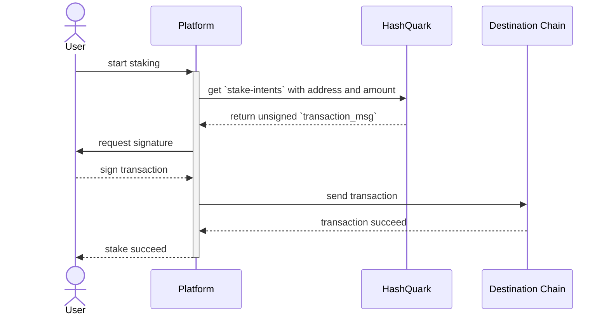

# Cosmos Ecosystem

## Supported Token In HashQuark

| **Token** | **Chain**                               | **Token** | **Chain**                                   |
| --------- | --------------------------------------- | --------- | ------------------------------------------- |
| ATOM      | [Cosmos](https://cosmos.network/)       | ATOLO     | [Rizon](https://rizon.world/)               |
| JUNO      | [Juno](https://junonetwork.io/)         | UYA       | [UnUniFi](https://ununifi.io/)              |
| DYDX      | [DyDx](https://www.dydx.foundation/)    | SOMM      | [Sommelier](https://www.sommelier.finance/) |
| XPRT      | [Persistence](https://persistence.one/) | XPLA      | [XPLA](https://www.xpla.io/)                |
| NYM       | [Nym](https://nymtech.net/)             | COREUM    | [Coreum](https://www.coreum.com/)           |
| ACRE      | [Arable](https://arable.finance/)       | BAND      | [Band](https://bandprotocol.com/)           |
| ARCH      | [Archway](https://archway.io/)          | AKT       | [Akash](https://akash.network/)             |
| HEART     | [Humans.ai](https://humans.ai/)         |           |                                             |

## API

#### stake

&#x20;<mark style="color:green;">\[POST]</mark> <mark style="color:red;">`/{ChainName}/mainnet/stake-intents`</mark>

Request body Example (Cosmos)

```json
{
  "address": "cosmos1c4k24jzduc365kywrsvf5ujz4ya6mwymy8vq4q",
  "amount": 10,
  "memo": "hashquark staking api"
}	
```

Response body Example (Cosmos)

```json
{
  "code": 200,
  "message": "success",
  "data": {
    "protocol": "cosmos",
    "network": "MainNet",
    "cosmos": {
      "transaction_msg": {
        "msgs": {
          "type_url": "/cosmos.staking.v1beta1.MsgDelegate",
          "value": {
            "delegator_address": "cosmos1c4k24jzduc365kywrsvf5ujz4ya6mwymy8vq4q",
            "validator_address": "cosmosvaloper1dxvfqyh6lwn8gvajvnxgy2z4ypc653h9lhs9rq",
            "amount": {
              "denom": "uatom",
              "amount": "100"
            }
          }
        },
        "memo": "hashquark staking api"
      }
    }
  }
}
```

#### unstake

&#x20;<mark style="color:green;">\[POST]</mark> <mark style="color:red;">`/{ChainName}/mainnet/deactivation-intents`</mark>

Request body Example (Cosmos)

```json
{
  "address": "cosmos1c4k24jzduc365kywrsvf5ujz4ya6mwymy8vq4q",
  "amount": 10,
  "memo": "hashquark staking api"
}
```

Response body Example (Cosmos)

```json
{
  "code": 200,
  "message": "success",
  "data": {
    "protocol": "cosmos",
    "network": "MainNet",
    "cosmos": {
      "transaction_msg": {
        "msgs": {
          "type_url": "/cosmos.staking.v1beta1.MsgUndelegate",
          "value": {
            "delegator_address": "cosmos1c4k24jzduc365kywrsvf5ujz4ya6mwymy8vq4q",
            "validator_address": "cosmosvaloper1dxvfqyh6lwn8gvajvnxgy2z4ypc653h9lhs9rq",
            "amount": {
              "denom": "uatom",
              "amount": "100"
            }
          }
        },
        "memo": "hashquark staking api"
      }
    }
  }
}
```

#### restake

&#x20;<mark style="color:green;">\[POST]</mark> <mark style="color:red;">`/{ChainName}/mainnet/restake-intents`</mark>

Request body Example (Cosmos)

```json
{
  "address": "cosmos1c4k24jzduc365kywrsvf5ujz4ya6mwymy8vq4q",
  "amount": 10,
  "srcVal": "cosmosvaloper1c4k24jzduc365kywrsvf5ujz4ya6mwympnc4en",
  "dstVal": "cosmosvaloper1dxvfqyh6lwn8gvajvnxgy2z4ypc653h9lhs9rq",
  "memo": "hashquark api"
}
```

Response body Example (Cosmos)

```json
{
  "code": 200,
  "message": "success",
  "data": {
    "protocol": "cosmos",
    "network": "MainNet",
    "cosmos": {
      "transaction_msg": {
        "msgs": {
          "type_url": "/cosmos.staking.v1beta1.MsgBeginRedelegate",
          "value": {
            "delegator_address": "cosmos1c4k24jzduc365kywrsvf5ujz4ya6mwymy8vq4q",
            "validator_src_address": "cosmosvaloper1c4k24jzduc365kywrsvf5ujz4ya6mwympnc4en",
            "validator_dst_address": "cosmosvaloper1dxvfqyh6lwn8gvajvnxgy2z4ypc653h9lhs9rq",
            "amount": {
              "denom": "uatom",
              "amount": "100"
            }
          }
        },
        "memo": "hashquark staking api"
      }
    }
  }
}
```

#### withdraw rewards

&#x20;<mark style="color:green;">\[POST]</mark> <mark style="color:red;">`/{ChainName}/mainnet/restake-intents`</mark>

Request body Example (Cosmos)

```json
{
  "address": "cosmos1c4k24jzduc365kywrsvf5ujz4ya6mwymy8vq4q",
  "memo": "hashquark api"
}
```

Response body Example (Cosmos)

```json
{
  "code": 200,
  "message": "success",
  "data": {
    "protocol": "cosmos",
    "network": "MainNet",
    "cosmos": {
      "transaction_msg": {
        "msgs": {
          "type_url": "/cosmos.distribution.v1beta1.MsgWithdrawDelegatorReward",
          "value": {
            "delegator_address": "cosmos1c4k24jzduc365kywrsvf5ujz4ya6mwymy8vq4q",
            "validator_address": "cosmosvaloper1dxvfqyh6lwn8gvajvnxgy2z4ypc653h9lhs9rq"
          }
        },
        "memo": "hashquark staking api"
      }
    }
  }
}
```

## Stake Process

1. Call API `[POST] /{ChainName}/mainnet/stake-intents` to get the unsigned `transaction_msg`
2. Sign transaction\_msg and send transaction
3. Wait for rewards and query

## Process Sequence Diagram

#### stake


