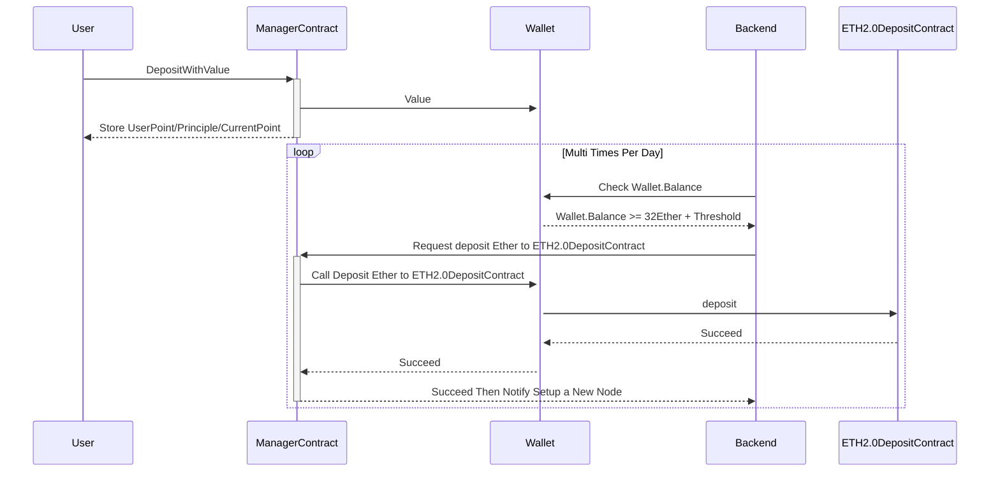
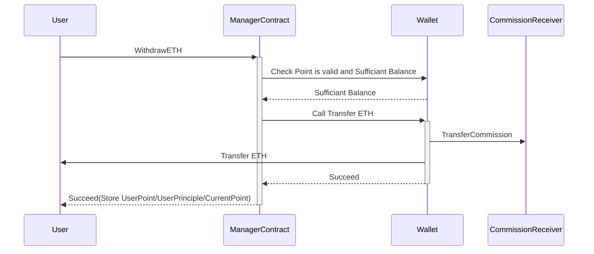
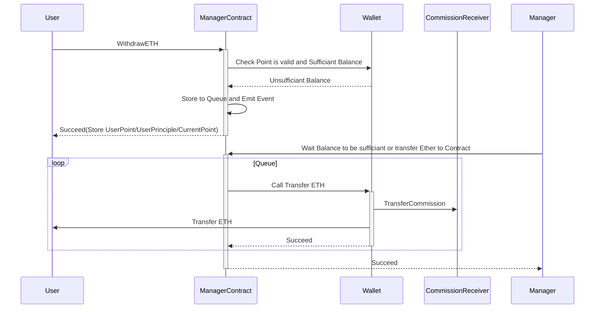

# Overview

## Pooled Staking Features

1. A Small Funds Custody Scheme (Funds Held in the Contract);
2. All information is publicly transparent and verifiable;
3. "Point" replacing "Liquidity", with a logic similar to "Liquid Staking";
4. The service provider is only responsible for the startup and withdrawal of nodes;

## Fundamental Information

**Terminology:**

> **`LastTotalPoint`**: the total supply of Points at the previous snapshot&#x20;
>
> **`LastTotalETH`**: the total value of ETH (including earnings) at the previous snapshot&#x20;
>
> **`Rate`**: the ratio based on data from the previous snapshot point (used for the current ETH/Point exchange rate)&#x20;
>
> **`CurrentPoint`**: the current total supply of Points&#x20;
>
> **`UserPoint`**: the user’s total value of Points&#x20;
>
> **`UserPrincipal`**: the user's calculated ETH principal

**Calculation Formula:**

> **The Point value obtained from user deposits (DepositETH):**&#x20;
>
> AddPoint = DepositETH \* LastTotalPoint / LastTotalETH;&#x20;
>
> **The ETH (including commission fees) obtained from user withdrawals (WithdrawPoint):**&#x20;
>
> WithdrawalETH = WithdrawPoint \* LastTotalETH / LastTotalPoint;&#x20;
>
> **The withdrawal fee charged to the user:**
>
> Commission = (WithdrawalETH - WithdrawPoint / UserPoint \* UserPrinciple) \* CommissionFeeRate&#x20;
>
> **The ETH received by the user:**&#x20;
>
> ActualETH = WithdrawalETH - Commission

## User Deposit and Withdrawal Process

**deposit process:**

**withdrawal process (when the balance of Wallet Contract is sufficient):**

**withdrawal process (when the balance of Wallet Contract is insufficient):**

